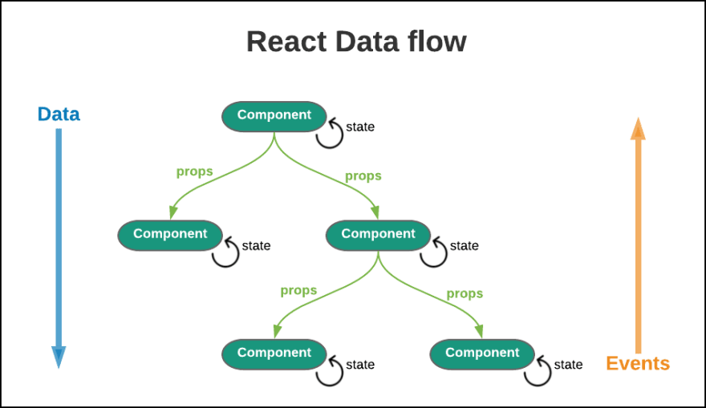

- React 생태계에서 사용하는 상태관리 라이브러리
- Redux를 사용하기도 하지만 사용하기 쉽기 때문에 최근에는 Zustand를 많이 쓴다.
## 사용하는 이유
### 1. Props 드릴링

- React의 데이터 흐름을 살펴보면, 무조건 상위 컴포넌트만 하위컴포넌트로 데이터를 넘기는 흐름을 볼 수 있다.
- 만약 하위 컴포넌트가 매우 많은 상황에서, 최 하단의 컴포넌트까지 데이터를 전달하려면 그 컴포넌트의 경로에 존재하는 모든 컴포넌트들이 사용하지도 않는 props를 가지고 있는 상황이 될 것이다.
- 결과적으로 **prop drilling**이 일어난다.
- 이는 유지보수를 어렵게 하고, 성능이 처하될 우려까지 생기게 된다.
### 2. 데이터 일관성
- 여러 컴포넌트에서 같은 상태를 관리할 경우, 일관성을 유지하기 어렵다.
### 3. 재사용성
- 같은 상태 로직을 여러 곳에서 사용할 경우, 코드를 중복으로 작성해야 할 수 있다.

## Zustand의 사용방법
- Zustand는 다른 상태관리 라이브러리 보다 간단한 사용 방법이 장점이다.
### 설치
``` bash
# NPM
npm install zustand

# Yarn
yarn add zustand
```

### store 생성
- store는 말 그대로 저장소라 생각하면 된다.
- 변할 상태와 상태를 업데이트하는 함수를 담고 있다. 
- store을 생성하기 위해 `create` 함수를 사용한다.
``` ts
import { create } from "zustand";

type Counter = {
	counter: number;
	addCounter: () => void;
	resetCounter: () => void;
};

const useCounter = create<Counter>((set) => ({
	counter: 1,
	addCounter: () => set((state) => ({ counter: state.counter + 1 })),
	resetCounter: () => set({ counter: 0 }),
}));

export default useCounter;
```
- create에 제네릭으로 타입을 선언해준 후 상태는 초기값을, 업데이트할 함수는 set을 사용하여 값을 업데이트하는 로직을 작성해 준다.
- 이러면 전역으로 사용 가능한 상태를 생성한 것이다.
### 상태 변수 및 액션 사용
- 상태 변수와 액션을 사용하기 위해 방금 만든 `useCounter`을 컴포넌트에서 호출해준다.
``` tsx
const CounterPage = () => {
	const { counter, addCounter, resetCounter } = useCounter();

	return (
		<div>{counter}</div>
		<button onClick={() => addCounter()}>add</button>
		<button onClick={() => resetCounter()}>reset</button>
	);
}
```
- 그리고 위와 같이 `useCounter`의 업데이트 함수를 사용하면 counter이 변경되는 모습을 볼 수 있다.
- zustand의 `create`는 `useState`와 같이 값이 변경되었을 때 리렌더링을 하기 때문에 `useCounter`를 사용하는 모든 컴포넌트에서 리렌더링 되어 값이 반영되는 것을 확인할 수 있다.